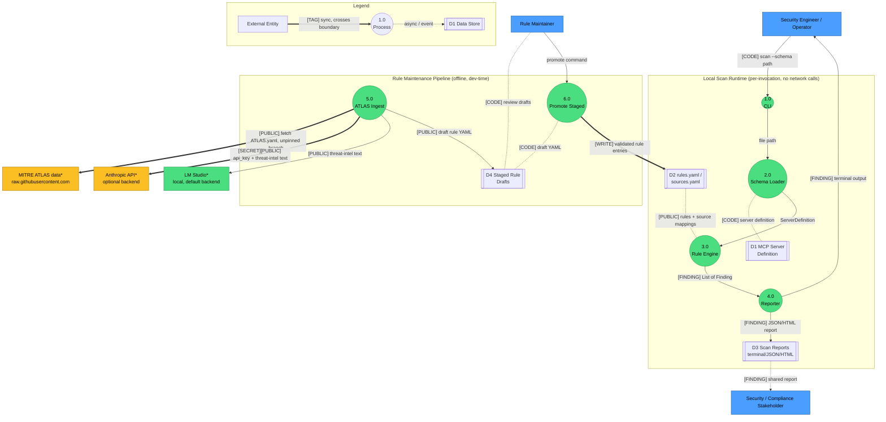

# Threat Model Draft: mcp-sentinel

Draft for threat-modeling prep, generated by the dfd-threat-model skill. Not a substitute for a reviewed architecture diagram.

## Assumptions

- `live.py` (Phase 3 dynamic probing of a running MCP server) is an explicit `NotImplementedError` placeholder, not yet active — excluded from boundary crossings until implemented.
- Treated LM Studio as staying inside the Rule Maintenance trust zone since it's the default local backend; only Anthropic is treated as a third-party crossing.

## Items for a human reviewer to verify

- **ATLAS fetch (`e_atlas_github`)**: confirm whether the fetched `ATLAS.yaml` should be pinned to a commit SHA or checksum-verified before it feeds rule generation.
- **Anthropic backend (`e_atlas_anthropic`)**: confirm the `--backend anthropic` path is opt-in only, never triggered in an automated/CI context without explicit configuration.
- **Rule promotion (`e_promote_rules`)**: confirm `rules.yaml` changes via `promote_staged.py` require PR review / CODEOWNERS, separate from general repo write access.
- **Input provenance (D1)**: confirm whether MCP server definitions being scanned could originate from an untrusted third-party catalog, which would change D1's classification from `CODE` to an externally-sourced, potentially attacker-controlled input.
